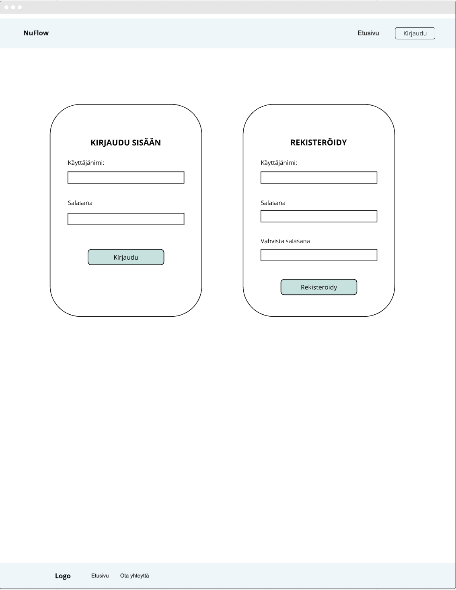
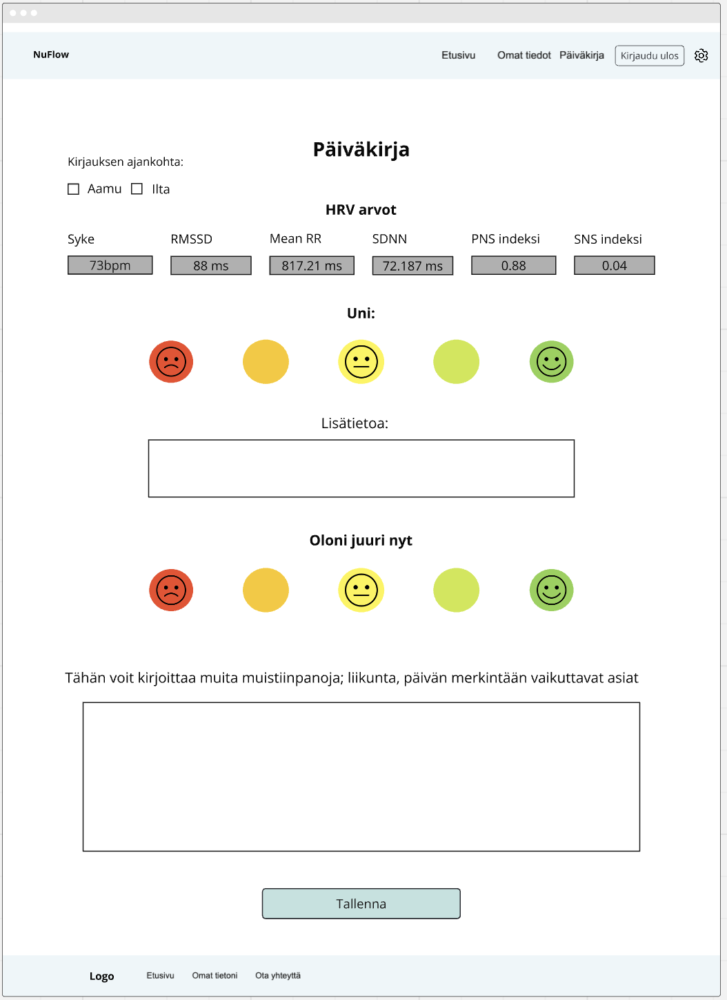
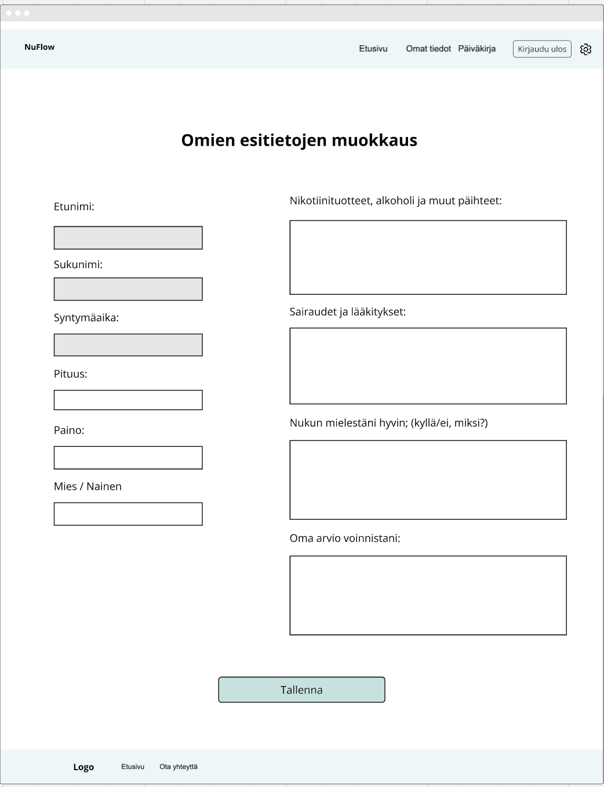

# NuFlow_projekti

## Kuvakaappaukset sovelluksen käyttöliittymästä

### Kuva 1. Etusivu.


### Kuva 2. Kirjautumissivu.


### Kuva 3. Esitietolomake.


### Kuva 4. Kirjautuneen käyttäjän etusivu.


### Kuva 5. Päiväkirjasivu.


### Kuva 6. Päiväkirjasivun analyysikaaviot.


### Kuva 7. Päiväkirjasivu raportin lähetys ammattilaiselle.


### Kuva 8. Asetukset.


### Kuva 9. Omat tiedot.


## Linkki julkaistuun sovellukseen (front-end)

[Linkki sovellukseen](http://72.145.13.207:5000/)

## Linkki käytössä olevaan back-end-sovellukseen/APIin

[Linkki APIin](http://72.145.13.207:5000/api/)


## Linkki API-dokumentaatioon (apidoc)

[API-dokumentaatio](https://attekangasmaki.github.io/NuFlow_backend/docs/index.html)


## Rautalankamallit

### Kuva 10. Rautalankamallin kirjautumissivu.


### Kuva 11. Rautalankamallin esitietolomake.


### Kuva 12. Rautalankamallin päiväkirjasivu.


### Kuva 13. Rautalankamallin prototyyppi analyysikuvaajista.


### Kuva 14. Rautalankamallin omat tiedot- sivu.


### Kuva 15. Rautalankamallin asetukset.


## Tietokannan kuvaus 


## Listaus ja kuvaus kaikista toiminnallisuuksista, mitä on toteutettu.

* Kirjautuminen Kubios- tunnuksilla.

* Esitietolomakkeen täyttäminen:

Ensimmäisellä kirjautumiskerralla käyttäjälle annetaan esitietolomake (Kuva 3), jossa
on neljä avointa kenttää: "”Nikotiinituotteet, alko-holi ja muut päihteet”, ”Sairaudet ja lääkitykset”,
”Nukun mielestäni hyvin”, ja ”Oma arvio voinnistani”. 

* Omien tietojen muokkaus poislukien sähköposti ja syntymäaika.

Omat tiedot- sivulta löytyvät Kubioksesta tuodut käyttäjän tiedot eli nimi, syntymäaika, sukupuoli,


* Päiväkirjamerkinnän täyttäminen ja tallentaminen.

* Päivän, viikon ja kuukauden HRV- analyysikaaviot Kubios- datalla.

* Poikkeavista arvoista hälyttäminen.

* PDF- Raportin muodostaminen.


* Käyttäjätilin poistaminen


## Mahdolliset tiedossa olevat bugit/ongelmat

* Ei tiedossa olevia bugeja tai ongelmia.


## Linkki ohjelmistotestauskansioon, mistä löytyvät testitapaukset ja -raportit

[Testit](tests/)


## Tekoälyn käyttö

* Sovelluksen kehityksessä on käytetty apuna Chat GPT 4.0- ja Claude Sonnet 3.7- tekoälykielimalleja


## GIT-Käyttöohje ryhmälle
Kaikki ryhmäläiset seuraavat tätä sääntöä jotta ei tulisi ongelmia GIT:n puolelta.

- Jokaisella ryhmäläisellä on oma branch ("oma nimi"_v2) näitä saa päivittää oman mielesi mukaan.
  
- TEST-branch on meidän pää kehityshaara johon tehdään meidän koodi. main-branch päivitetään ainoastaan silloin kun koodin uudet ominaisuudet ovat täysin toiminnallisia

- Nyrkkisääntönä on se, että määritellään kukin jäsen on vastuussa mistä osan koodista, jotta koodien yhdistämisessä ei tulisi ongelmia

### 1. Mitä tehdä ihan ensimmäisenä kun avaa VS-code

Ensimmäisenä on vetää kaikki uusimmat muutokset remote TEST-branchistä itsellesi omaan local branch

```bash
git pull origin TEST
```
Komento vetää ja päivittää TEST-branchin. Tämä on hyvä tehdä aina vaikka ei olisikaan muutoksia, jotta ei tule tilannetta jossa yrität päivittää oman koodin pohjan TEST-branchillä joka on jo valmiiksi vanha versio.

### 2. Koodin päivittäminen omaan branchiin
Jokaisen ryhmäläisen tulee päivittää niiden oma branch TEST-branchillä mikäli uusia päivityksiä löytyy. Tällä tavoin kaikki pysyvät ajan tasalla ja koodaavat niinsanotusti: "samaa pohjaa" aina.
ohessa askel kerrallaan miten tämä tehdään:

```bash
git fetch origin TEST
```
tämä komento hakee uusimmat remote branch muutokset repositoriossa ilman muutoksia omaan koodiin.

```bash
git checkout "oma-branch"_v2
```
tämä aktivoi sinun nykyisen oma branchin käyttöön jos se ei ole jo valmiiksi.

```bash
git merge origin/TEST
```
tämä yhdistää aikaisemmin haetun TEST-branchin koodin oman branchin koodiin kun aikaisemmat askeleet ovat suoritettu. 

### 3. oman koodin päivittäminen TEST:in
Kun omassa branchissä on valmis uusi ominaisuus, ryhmäläinen tulee kommunikoida viesti muille, niin että kaikki ryhmäläiset näkevät ja vastaavat tavalla tai toisella viestiin ennen kuin päivittää TEST-branchin


ohessa esimerkki jossa on peukalo-emoji myönteisenä vastauksena.


Kun saatu vastaus kaikilta ryhmäläisiltä ja olet päivittänyt TEST-branchin niin tulee laittaa viesti että päivitys on hoidettu. ällöin kaikki voi vetää päivitetyn TEST-branchin itselleen. 

Oman koodin lisääminen TEST:in toimii näin askel kerrallaan:

```bash
git checkout TEST
```
Aktivoi TEST-branchin

```bash
git merge "oma-branch"_v2
```
Tämä yhdistää oman branchin muutokset aikaisemmin aktivoituun branchiin

```bash
git add .
```
Tämä lisää kaikki uudet tiedostot, mikäli niitä on uusia.

```bash
git commit -m"uusi päivitys"
```
Tallentaa muutokset paikalliseen Git-repositorioon. Se luo uuden commitin, joka sisältää kaikki muutokset mitä `git add .` teki.

```bash
git push origin TEST
```
Tämä päivittää kaikki muutokset ja puskee sen githubin TEST branchiin.
